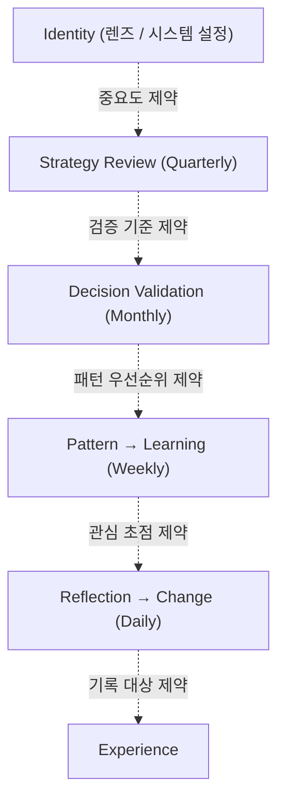
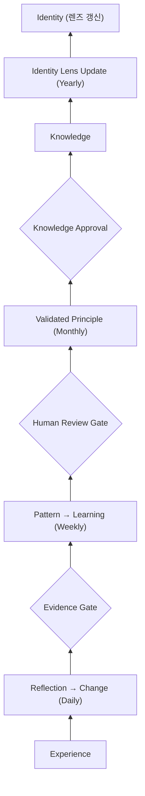

# Journal Operating Model

> Prodigy OS가 경험을 판단력으로 변환하는 공식 운영 모델 (single source of truth).
> 계층은 *시간*이 아니라 *질문의 깊이*로 나뉜다. 같은 경험에서 계층마다 꺼내는 것이 다르다.
> 회고 "쓰는 법"은 `Reflection Guide.md`, PRE 실행/산출물 위치는 `11_Operating_Guide.md` 참조.

## 위계

이 문서는 Journal System의 **운영 계약(single source of truth)**이다. `Reflection Guide.md`는 각 계층의 *작성법(how-to)*으로 이 문서의 하위 문서다. Daily·Weekly·Monthly·Quarterly·Yearly를 수정할 때는 Reflection Guide가 아니라 **이 문서**를 기준으로 한다. 둘이 충돌하면 이 문서가 우선한다.

## 운영 규칙

1. **시간이 아니라 질문 = 추출 필터.** Daily~Yearly는 기간 폴더가 아니라, 같은 입력에서 추출하는 것이 달라지는 필터다. 기간을 늘린다고 상위 계층이 되지 않는다.
2. **Review는 AI, 승격은 사람.** 패턴 감지·요약·원칙 제안은 AI가, 저장·승인·채택은 사람이 한다. 모든 게이트는 사람이 소유한다 (`AI Assists. Humans Decide.`).
3. **Identity는 출력이 아니라 필터.** Yearly의 결과는 노트 1개가 아니라 시스템 설정(렌즈) 갱신이다. 다음 모든 계층의 "무엇을 중요하게 볼지"를 바꾼다.
4. **Weekly는 Pattern → Learning.** AI가 반복을 찾고, 사람이 배움을 만든다. 패턴 감지만으로는 Weekly가 완성되지 않는다.

## 두 축

상향(승격)과 하향(필터 제약)이 Identity에서 만나 폐루프를 이룬다.

### 하향 축 — 필터가 아래로 흐른다

Identity 렌즈가 각 계층의 관심·기준·우선순위를 제약한다.

### 상향 축 — 증거가 게이트를 통과하며 올라간다

> 상향 승격 체인은 Daily → Weekly → Monthly → Knowledge → Yearly 렌즈 갱신으로 흐른다.
> Validated Principle은 구현에서 `knowledge_candidate`(검증 완료, approved 직전)이고,
> Knowledge Approval은 사람의 `approveCandidate` 클릭, Knowledge는 승격된 `knowledge` 노트다.
> 즉 Journal의 상향 승격 체인은 Knowledge Candidate 파이프라인과 같은 게이트를 공유한다.
> Quarterly의 Direction Change는 승격 단계가 아니라 Identity 렌즈와 Strategy 사이의 *재정렬*이므로
> 상향 체인의 별도 노드로 두지 않는다 (아래 Period 표의 Quarterly 행 참조).

## Period 계약

| Period | 핵심 질문 | 사용자가 쓰거나 결정할 역할 | 추출 필터 | 입력 | 산출물 | 승격 게이트 |
| --- | --- | --- | --- | --- | --- | --- |
| Daily | 오늘 무엇이 나를 변화시켰는가 | 오늘 무엇이 나를 변화시켰는지 기록한다. | 이벤트 분리 | Experience | Change · Experiment | Evidence Gate |
| Weekly | 무엇이 반복되고 무엇을 배웠는가 | 이번 주에 무엇이 반복되었고 무엇을 배웠는지 살펴본다. | 반복 감지 | 주간 Change 묶음 | Pattern · Learning · Suggested Principle | Human Review Gate |
| Monthly | 어떤 변화가 실제로 검증되었는가 | 이번 달의 변화가 반복된 근거로 검증되는지 확인한다. | 검증 | Suggested Principle | Validated Principle (= Knowledge Candidate) 또는 partial 관찰 기록 | Knowledge Approval |
| Quarterly | 지금 방향은 맞는가 | 검증된 변화와 결과를 바탕으로 지금의 방향이 맞는지 점검한다. | 전략 정렬 | Validated Principle 묶음 | Direction Change | 재정렬 (승격 체인 외부) |
| Yearly | 나는 어떤 사람이 되어가고 있는가 | 분기별 방향과 변화를 돌아보며 내가 어떤 사람이 되어가는지 성찰한다. | 정체성 성찰 | 전 기간 Direction | Identity Lens 갱신 | 시스템 설정 반영 |

## 보류 범위

- Journal Workspace는 Daily · Weekly · Monthly · Quarterly · Yearly 탐색 구조를 모두 제공한다. Monthly · Quarterly · Yearly는 기간 이동과 저장 기록 탐색을 제공한다. Monthly의 `AI 검증 보조`는 사용자가 명시적으로 실행할 때 선택 월의 구조화 Evidence만 읽어 초안을 제안하며, 자동 Review Engine이나 승격 기능은 제공하지 않는다.
- 게이트 계약(Evidence Gate / Human Review Gate / Knowledge Approval)은 정의되어 있다. Monthly 화면은 완료 Weekly가 없거나 필수 입력이 깨진 경우에만 새 기록을 막는다. Weekly가 하나 이상이지만 반복 Principle이 없으면 `question_only`로 열어 사람이 summary와 다음 달 방향을 partial 기록으로 남길 수 있다.
- Monthly의 Human Review Gate는 서로 다른 2개 Weekly에서 동일 normalized title의 Suggested Principle이 반복될 때만 Principle decision과 Knowledge Candidate 경로를 연다. 의미 유사성은 이 gate를 자동으로 바꾸지 않는다.
- Quarterly·Yearly는 현재 기간 이동·기록 탐색과 deterministic sparse 상태를 제공한다. 충분한 하위 기간 기록이 없으면 질문/draft 범위만 허용하며, 자동 Direction·Identity 승격은 별도 human-foundation 계획 전까지 제공하지 않는다.
- Monthly에서 검증된 Principle은 `source_type: monthly_validation` Knowledge Candidate로 저장되며, 기존 승인 화면에서 사람이 Knowledge 승격을 결정한다.
- 지금 활성화: Daily (경험을 Evidence로 남김), Weekly (반복에서 Pattern과 Learning을 찾음), Monthly (question-only 관찰 또는 Human Validation + 명시적 bounded AI 보조 + 기간 기록 탐색), Quarterly·Yearly (역할 문구 + deterministic 준비 상태 + 기간 기록 탐색).
- 순서는 `Implement → Use → Observe → Improve`. 빈 방을 먼저 짓지 않는다.

## 운영 모델 ↔ 구현 매핑

- **Evidence Gate** = Daily Evidence 품질 계산 (`evidence-quality-core`).
- **Daily human completion** = 작성 중인 Daily를 사람이 `작성 완료`로 닫을 때 `status: completed`와 `completed_at`을 함께 기록한다. 이는 Evidence의 품질·내용을 자동으로 보강하거나 Weekly의 근거를 만들지 않는다.
- **Human Review Gate** = Weekly Suggested Principle을 Monthly에서 사람이 검증.
- **Validated Principle** = 구현에서 `knowledge_candidate`(검증 완료, approved 직전).
- **Knowledge Approval** = `approveCandidate`(사람 클릭, `knowledge-candidate-view`).
- **Knowledge** = 승격된 `knowledge` 노트.

Journal의 상향 승격 체인과 Knowledge Candidate 파이프라인은 같은 게이트를 공유하므로,
Weekly/Monthly에서 나온 원칙 후보는 결국 Knowledge Candidate 승인 게이트로 들어간다.

## 관련 문서 (정본 = 이 문서)

- `SYSTEM/docs/Reflection Guide.md` — 각 계층을 *어떻게 쓰는가* 가이드.
- `SYSTEM/docs/11_Operating_Guide.md` — Weekly PRE 실행 명령·산출물 위치.
- `SYSTEM/docs/00_Constitution.md` — Suggested Principle 원칙 (변경 없음).
