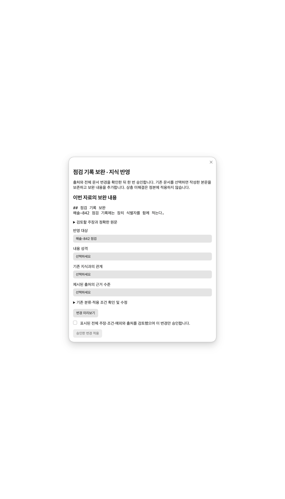

# LLM Wiki Vertical Recovery Sprint — 2026-09-09

## 판정

**실제 vertical Canary: PASS — Human Review Ready.** 최종 코드로 Obsidian에서 질문 버튼과 제안 검토 버튼을 직접 눌렀으며, 기존 검토 화면에서 원문 일치를 확인했다. 자동 승인·canonical 쓰기·Object 변경·Git commit/push·release는 하지 않았다.

**전체 Sprint DoD: NOT COMPLETE.** 확장 회귀 suite는 수정 전과 동일한 49개 실패가 남는다. 새 실패는 0개다. 기존 감사의 핵심 18/18 및 별도 runtime 78/78은 통과했다. 전체 기존 suite 통과 조건을 충족했다고 표현하지 않는다. 범위 밖 기존 실패를 이번 P0 복구에 섞어 수정하지 않았다.

## Before / After — 순서별 gate

| 단계 | Before | 최종 결과 / 실행 근거 |
|---|---|---|
| 1 Source recognized / projection | 선택·projection 통과 | PASS: 실제 `INBOX/LLM Wiki Recovery Canary.md`, source revision 검증 |
| 1 Query corpus inclusion | `prefixMetadata` / `rowFrom`에서 INBOX 제외 | PASS: 선택한 정확한 경로만 메모리 snapshot에 포함; 본문 문구와 `#L1-L6` 반환 |
| 2 Retrieval / scope | 전체·대기 scope `invalid_scope_type` | PASS: literature/all Canary 1건, verified/pending 0건 정상 반환. 모든 INBOX를 verified로 승격하지 않음 |
| 3 Provider executable | restricted PATH에서 `spawnSync agy ENOENT` | PASS: 실제 Obsidian PATH `/usr/bin:/bin:/usr/sbin:/sbin`, 기존 antigravity desktop-cli 응답 수신 |
| 4 Explicit retry | Hub intent 유실 | PASS: normal continue blocked/provider 0회; 명시 retry claim 후 실제 provider 1회, review_ready (12,143.9ms) |
| 5 Source body + locator | 질문 provider context 미연결 | PASS: 관련 원문 2개 excerpt, `#L3-L3` / `#L5-L5`, hash/trust 포함 |
| 6 Cited answer | provider 도달 전 실패 | PASS: 질문 “청록등대-731 검토 원칙은 무엇인가?” → 원문 근거와 변경 내용을 함께 확인한다는 답변 및 정확한 인용 |
| 6 No answer | 미검증 | PASS: 무관 질의는 provider 호출 없이 abstain; 같은 주제의 작성자 이름 질의도 실제 provider 응답 후 abstain |
| 7 Proposal validation | 도달 못 함 | PASS: 기존 strict semantic schema → `buildProposalBundle` → 16 필드 librarian metadata → 기존 materializer / risk packet 검증 |
| 8 Human Review handoff | 질문 경로 미연결 | PASS: 실제 “지식 변경 검토”, 승인·거절·수정 요청 및 출처 보기. `verifyRiskApprovalPacket` ok=true |

최종 실행 자료: [final-live.json](final-live.json), [final-review-verification.json](final-review-verification.json). 앞 단계 실행 및 재시도: [live-phases-1-7.json](live-phases-1-7.json), [phase4-reclaim.json](phase4-reclaim.json), [live-review-and-retry.json](live-review-and-retry.json). 이전 중간 구현 결과보다 final-live를 최종 기준으로 사용한다.

## 수정 지점과 실제 호출 연결

| 파일 / 심볼 | 수정과 연결 |
|---|---|
| `SYSTEM/Views/llmwiki-wiki-read-adapter.js` `buildSelectedSourceSnapshot`, `prefixMetadata`, `prepareQuestionContext` | 선택·privacy·revision·scope 검증 후 정확한 source만 literature snapshot 포함. 기존 queryRead로 excerpt 검색, 최대 4개 × 2048 bytes 근거 구성 |
| `llmwiki-query-readonly.js` `typesForMode` | 기존 mode/type vocabulary를 browseRead가 재사용. 기존 fleeting_note 대기 범위 불일치 수정 |
| `/Users/prodigykim/Developer/prodigy-ai-runtime/src/desktop-process.ts` `resolveDesktopExecutable`, `runProcess` | 명시 absolute executable 우선, 기존 PATH 및 홈 `.local/bin` 등 한정 discovery, 실행 권한 확인 후 shell:false spawn. 잘못 지정한 absolute path는 다른 실행파일로 대체하지 않음 |
| `HUB/50 Knowledge.md` `dispatchLifecycleAction`, `runGoldenWiki` → `llmwiki-golden-wiki-orchestrator.js` → `llmwiki-batch-analyzer.js` | explicit_retry와 일회 intent를 기존 claimExplicitRetry까지 전달. 자동 retry 없음 |
| `llmwiki-batch-provider-input.js` `questionPrompt`, `mapTransportError`; `llmwiki-batch-provider.js` | 기존 provider structured request에 질문 및 untrusted evidence 추가. strict schema는 변경하지 않음 |
| `llmwiki-wiki-read-service.js` `answerSourceQuestion` | selected source 읽기 → query context → 실제 `wiki.batch_analysis` runtime → provider parser/schema → exact quote 재검증. source hash 변경 시 중단 |
| 같은 파일 `prepareQuestionProposal`, `handoffQuestionProposal` | branded 실제 답변만 proposal 생성; 기존 `InboxProposalMaterializer.materialize` → `openPreparedRiskReview`. 기존 검토가 있으면 덮어쓰지 않음 |
| `llmwiki-wiki-surface.js` `askQuestion`, `prepareReview`; Hub mount callback | 실제 선택 원문 질문 버튼, 처리 상태, cited answer 및 제안 검토 버튼, 기존 원문 modal 연결 |
| `llmwiki-lifecycle-view.js`, `prodigy-wiki-controller.js` | 검토 packet이 source 선택 화면에 가려지는 문제 수정. retry와 다른 원문 선택 진입점 |
| `llmwiki-ui-recovery.js` | 기존 recovery 문구에 단계별 실패·재시도 안내 추가 |

프로덕션 파일은 Vault 12개 및 별도 runtime source 1개를 수정했다. 설치된 Obsidian runtime bundle은 해당 desktop-process 블록만 반영했다. 저장소에 이미 있던 다른 변경은 보존했다. 새 framework, engine, object, canonical property, dependency를 추가하지 않았다.

## 실제 재현 경로

1. Obsidian `HUB/50 Knowledge` → 자료 직접 선택 → LLM Wiki 복구 시험 → Prodigy Wiki 검토.
2. 검색창에 `청록등대-731 검토 원칙은 무엇인가?` → **선택한 원문에 질문**.
3. 답변의 citation 확인 → **첫 claim을 제안으로 검토**.
4. 자동으로 기존 검토 탭이 열림 → **출처 보기** → **현재 원문과 일치** 확인. **승인은 누르지 않는다.**

현재 실제 검토 controller는 `status: review`, risk packet 1개다. run_id: `question_1e0148b60ea9d8a666b22a00`.

읽기 전용 확인 명령:

```sh
/Applications/Obsidian.app/Contents/MacOS/Obsidian vault="Dusk" eval code='KnowledgeExplorerHub.llmWikiBrowse.getQuestionState()'
/Applications/Obsidian.app/Contents/MacOS/Obsidian vault="Dusk" eval code='KnowledgeExplorerHub.llmWikiRunController.getSnapshot().risk_packets.map(p=>LLMWikiRiskApprovalPacket.verifyRiskApprovalPacket(p))'
```

실제 retry 재현 코드는 [retry-live.cjs](retry-live.cjs)에 있다. production blocked 상태를 직접 바꾸지 않고 임시 fs store의 blocked canary를 기존 analyzer 및 실제 app runtime으로 재실행했다. 이는 mock provider 검증이 아니다.

## Packet / trust / 쓰기 검증

16개 필드(run_id, proposal_id, payload_hash, status, kind, citations, locators, confidence, entity_links, theme_links, material_links, graph, lint, contradictions, approval, refusals)를 유지했다. provider strict schema 및 기존 proposal/risk validator를 완화하지 않았다. 최종 runtime에서 legacy LLMWikiApprovalPacket 전역은 undefined이며 이에 의존하지 않는다.

원문은 untrusted_data_only, 답변 confidence는 inferred, 원문 exact quote는 explicit이다. source revision은 질문 전후·proposal 준비·handoff에서 재검증한다. UI는 기존 관련 Knowledge/충돌 자동 비교를 수행하지 않았음을 명시한다. 빈 배열을 “충돌 없음이 증명됨”으로 표현하지 않는다.

proposal 목적지는 기존 `ZETA/CANDIDATES/document_9b8faab211b1d88a7c182371.md`; 현재 **파일은 존재하지 않는다**. writer_count=0. 승인 이벤트는 발생하지 않았다. 정식 Knowledge 승격은 기존 별도 사용자 승인 및 deterministic writer 재검증 경계다.

`ZETA/PERMANENT`, `ZETA/LITERATURE`, `ZETA/CANDIDATES`, `PARA/RESOURCES/Knowledge`, `.llmwiki-audit` 111개 파일의 전후 digest가 동일하다. [canonical-before.json](canonical-before.json), [canonical-after.json](canonical-after.json). digest 산출은 명시된 root 순서 안에서 각 경로를 정렬한다. 검증 artifact 및 허용된 합성 Canary만 저장했다.

## 성능 (최종 실제 실행, ms)

| 단계 | 시간 |
|---|---:|
| projection | 0.70 |
| retrieval | 1.10 |
| context assembly | 0.00 |
| provider | 7474.10 |
| parsing | 개별 분리 측정 불가; provider 시간에 포함 |
| local validation | 7.80 |
| proposal assembly | 5.70 |
| review handoff | 10.90 |
| 처리 합계 (사용자 클릭 대기 제외) | 7509.90 |

context assembly 0은 현재 시계 해상도 내 측정값이다. JSON의 parsing=0은 이미 parse된 runtime 응답을 받는 consumer 측 값으로 실제 parser 비용 0을 뜻하지 않는다. 총 처리 합계는 answer total+proposal assembly+handoff다. 최종 provider retry_count=0, fallback 없음. 작은 Canary의 병목은 provider이며 Vector DB 필요성을 입증하는 결과는 없다. 대규모 corpus/semantic 품질 벤치마크로 일반화하지 않는다.

## 오류 및 상태

executable/auth/quota/rate/transport/parse/schema/retry claim/proposal/review 실패는 기존 runtime 코드에서 recovery 상태로 전달한다. 기존 vocabulary인 provider_auth_required, provider_quota_exhausted, blocked는 유지한다. executable_not_found 등 누락된 구분만 보완했다. 소스 제외·empty·no evidence·scope 오류도 별도 이유를 유지한다. UI에는 검색, AI 응답 대기, 검증, 제안 준비, 검토 대기를 표시한다.

실제 정상 provider, 실제 abstain, 실제 blocked retry는 실행했다. 모든 외부 인증/429 장애를 실서비스에 강제로 발생시켜 검증한 것은 아니다. fault mapping 테스트와 실제 canary 증거를 혼동하지 않는다.

## 회귀

- 기존 감사 핵심: **18/18 PASS** — [core-18.tap](core-18.tap).
- provider runtime: **78/78 PASS**, TypeScript check PASS — [runtime-regression.tap](runtime-regression.tap).
- 최종 집중 회귀: **38/38 PASS** — [targeted-regression.tap](targeted-regression.tap).
- 확장 baseline: 926개 / 876 PASS / 49 FAIL / 1 SKIP.
- 최종 확장: 930개 / 880 PASS / 49 FAIL / 1 SKIP. **새 실패 0** — [regression-comparison.json](regression-comparison.json).
- `git diff --check` PASS.

baseline은 작업 전 원본을 Node fs read overlay로 읽어 같은 테스트를 실행했다. 사용자 작업트리를 checkout/reset하지 않았다. 확장 실행에서는 별도 CDP가 필요한 real-Obsidian fixture를 제외했으며 실제 UI는 Obsidian/CUA로 검증했다. baseline/current 전체 로그의 failure name 집합이 동일하다. 기존 static wiring/provider expectation 등 실패를 이 Sprint가 해결했다고 주장하지 않는다.

테스트 재현:

```sh
node --test SYSTEM/AI/Skills/prodigy-review/tests/knowledge/test_llmwiki_query_readonly.js SYSTEM/AI/Skills/prodigy-review/tests/knowledge/test_llmwiki_skill_contract.js SYSTEM/AI/Skills/prodigy-review/tests/knowledge/test_wiki_ai_runtime_consumers.js SYSTEM/AI/Skills/prodigy-review/tests/knowledge/test_prodigy_wiki_controller.js
node --test SYSTEM/AI/Skills/prodigy-review/tests/knowledge/test_llmwiki_document_batch_integration.js SYSTEM/AI/Skills/prodigy-review/tests/knowledge/test_llmwiki_vertical_recovery.js SYSTEM/AI/Skills/prodigy-review/tests/knowledge/test_llmwiki_golden_wiki_orchestrator.js
```

확장 파일 목록은 [regression-files.json](regression-files.json)에 저장했다. 해당 목록과 `test_llmwiki_vertical_recovery.js`를 `node --test`에 전달한다. 별도 runtime repository에서 `npm run check`, `npm test`를 실행한다.

## 남은 범위와 권고

**A. Fix runtime only**가 이번 Canary 복구에 충분했다. 선택된 source의 질문/근거/제안/검토는 실제로 연결되었다. Vault 전체 semantic QA, 자동 related Knowledge/contradiction 비교, 영속 chat이나 background 작업은 추가하지 않았다. 제안은 기존 검토 controller의 메모리 상태이며 이번 Sprint에서 새로운 영속 queue를 만들지 않았다.

다음 완료 조건은 확장 suite의 기존 49개 실패를 별도 범위로 정리·해결하는 것이다. 그 전까지 전체 DoD 완료 또는 release 가능 판정은 보류한다. 실제 canonical 승인/쓰기 실행은 요청 범위 밖이므로 실행하지 않았으며 해당 writer의 기존 regression으로 경계를 점검했다.


---

# Phase A — 결과물 사전 검수 (2026-09-09, 구현 없음)

## 1. 검수 범위와 실제 확인 수준

기준은 로컬 HEAD `9957444e51023d32e891d01bc49e175bffe1dd98`와 미커밋 복구 코드다. GitHub 상태를 대입하지 않았다. 기존 audit REPORT, 이 recovery REPORT, final-live, final-review-verification, live-phases-1-7, live-review-and-retry, retry harness, baseline/final/core/runtime 로그 및 현재 관련 구현·계약을 읽었다.

별도 runtime checkout HEAD는 `4b3804327e76b2d680818a7b6df18930fb8f9ee6`이며 `src/desktop-process.ts` 수정과 새 테스트가 미커밋 상태다. 실행파일 discovery/spawn 구현을 현재 소스에서 읽었고 이번에는 수정하지 않았다.

[현재 코드 hash](phase-a/code-before.json), [working tree](phase-a/working-tree-before.txt)를 고정했다. 기존 보고서에는 최종 source hash manifest가 없어서 과거 실행 시점과 현재 전체 checkout의 byte 동일성을 독립 증명할 수 없다. 복구 심볼과 미커밋 변경은 보고서 설명에 대응하며, 현재 Obsidian에 로드된 question/context/provider/surface/prepare/handoff 함수는 현재 파일과 일치한다. 그래서 현재 기능 품질은 현재 모듈의 새 실행으로 확인했다. 읽지 않은 설정/secret은 검사했다고 표현하지 않는다.

증거 수준:

- 기존 정상 Canary/작성자 no-answer/실제 blocked retry는 **과거 실행 증거 재사용**. 정상 citation의 파일·line·hash와 현재 Human Review packet은 **이번 읽기 전용 재검증**.
- 새로운 조건/상충 시험은 **현재 production 함수 + 격리 합성 vault adapter + 실제 기존 provider**. 앱 전역 모듈/config/동의를 바꾸지 않았다. 두 합성 경로는 harness 안의 virtual INBOX이며 실제 Vault 파일을 생성하지 않았다. 해당 citation의 byte/line을 검증했지만 실제 파일 열기 UI 성공으로 계산하지 않는다.
- 실제 Obsidian 화면은 기존 Canary review/citation을 확인하고 [화면 이미지](phase-a/review-screen.png)와 [선별 DOM](phase-a/ui-observed.json)을 저장했다. 새 합성 결과를 실제 Hub 화면에 삽입하지 않았다.
- failure/retry/double-click은 **격리 fake DOM·fake transport + 실제 surface/service**로 재현. 실서비스 장애를 강제로 발생시키지 않았다.
- 새 실제 provider 응답은 [live-inspection.json](phase-a/live-inspection.json)에 request/structured response/receipt/result/proposal과 함께 보관했다. 최초 observer Proxy harness는 호출 전 실패했고, 다음 observer는 API object identity가 달라 응답 수신 뒤 stale epoch가 됐다. 이들은 제품 실패가 아니다. 최종 harness는 identity를 유지했다. 실제 provider 호출 총 4회(보정 전 수신 2회+최종 2회), 최초 전단 실패 2회는 network 미호출. 최종 각각 retry_count=0, provider 전환 없음.
- 과거 정상 answer의 최종 raw CLI stdout은 final-live에 없다. 최종 사용자 answer·context·receipt·packet이 보존돼 있다. 이번 raw structured payload는 별도 보존했고 CLI stdout 보관을 새 runtime 기능으로 추가하지 않았다.

[사전 기대값](phase-a/expectations.json)은 호출 전에 작성했다. 조건 자료는 415 UTF-8 bytes, 상충 자료는 265 bytes다. 운영 자료·private Journal·People를 시험에 사용하지 않았다.

## 2. 판정

| 항목 | 판정 | 이유 |
|---|---|---|
| ENGINEERING ACCEPTANCE | **REVISE** | 실행은 가능하지만 중요한 조건 누락, 상충 설명/Proposal 보존 부족, review retry 불능, 전송 상태 오표시, 이전 job 상태 덮어쓰기 보정 필요 |
| UI VERIFICATION | **FAIL** | 실제 화면 접근·원문 확인은 성공. 그러나 이미 전송된 Canary에 미전송 표시, 미검사 충돌을 없음으로 표시. 미확인 UI를 PASS 처리하지 않음 |
| USER ACCEPTANCE | **PENDING** | 아래 예시를 사용자가 아직 승인하지 않음 |

현재 범위에서 무단 canonical 쓰기·선택 범위 외 읽기/전송은 관찰하지 않았다. 이를 전체 보안 인증으로 확대하지 않는다. 이 보고서 앞부분의 “49개 전부 해결 후 다음 작업”은 과거 Sprint 해석이다. **이번 Phase A에서는 관련 P0/P1 보정이 선행 조건이며 무관한 전체 실패 해소를 일괄 조건으로 만들지 않는다.**

## 3. 실제 출력 예시

### 예시 1 — 정상 답변 (과거 실제 provider, citation/UI는 이번 재확인)

질문: **청록등대-731 검토 원칙은 무엇인가?**

선택 범위: `INBOX/LLM Wiki Recovery Canary.md` 하나, supporting literature, verified 아님.

사용자용 답변 전문(인용 버튼/안내를 제외한 모든 answer text):

> 청록등대-731 검토 원칙은 결정을 저장하기 전에 원문 근거와 변경 내용을 함께 확인하는 것이다.
> 
> 청록등대-731의 확인 항목은 원문 근거와 변경 내용 두 가지다.

핵심 근거: `#L3-L3`의 “청록등대-731 검토 원칙: 결정을 저장하기 전에 원문 근거와 변경 내용을 함께 확인한다.” 두 번째 답변은 `#L5-L5`의 “확인 항목은 원문 근거와 변경 내용 두 가지다.”를 포함한 문장에 연결된다. source SHA256은 `7b494f0b2f7f93aa01b346f7b056567726d9fec1ac9687a7e32a3cd0d9cbd7a8`.

이번 확인: 두 line locator 모두 해당 원문과 정확히 일치, 파일 존재/hash 동일. 실제 review 출처 modal에서 “현재 원문과 일치”. 질문 직접 해결, 조건 “결정 저장 전” 보존. 부족: 두 답변의 정보가 중복되고, 인용 본문도 반복 노출된다. 단일 간단 사실을 넘어선 품질 증거는 아니다.

### 예시 2 — 어려운 경우 (이번 실제 provider, 격리 source adapter)

질문: **해솔-842 점검 절차를 빠짐없이 정리해줘.**

허용 자료는 합성 A 하나. 질문 전에 고정한 원문 사실은 (1) 실내 모형, (2) 10분, (3) 시작 전 전원 확인, (4) 종료 후 시간 기록, (5) 실외 적용 금지, (6) 경고등 즉시 중단·재개 금지다. 실제 사용자용 answer text 전문:

> 해솔-842 점검의 적용 대상은 실내 모형 장치다.
> 
> 해솔-842 점검의 기본 점검 시간은 10분이다.
> 
> 해솔-842 점검 시작 전에 전원 표시를 확인한다.
> 
> 해솔-842 점검 종료 후 점검 시간을 기록한다.

인용은 각각 가상 A의 L3/L5/L7/L9에 정확히 연결된다. **L11 실외 금지와 L13 경고등 중단이 검색 상위 4개 제한에서 제외**되었다. provider가 볼 수 없었던 조건을 답변도 누락했고 범위 부족 안내가 없다. fact 4개가 맞고 schema PASS여도 “빠짐없이” 해결은 FAIL이다. 사용자가 이 답을 전체 절차로 오해할 수 있다. 이는 대규모 성능 문제가 아니라 415 bytes에서도 발생한 조건 보존 문제다.

상충 시험도 숨기지 않는다. 질문: **은빛-593 점검 시간은 몇 분인가?** 허용 자료는 합성 B 하나에 명시된 두 규정이다. 두 파일 비교 시험을 수행한 것으로 간주하지 않는다.

실제 answer text 전문:

> 은빛-593 점검 규정 A에 따르면 동일한 실내 모형의 점검 시간은 10분이다.
> 
> 은빛-593 점검 규정 B에 따르면 동일한 실내 모형의 점검 시간은 20분이다.

각 주장과 인용은 맞으며 평균값이나 임의 우선순위는 만들지 않았다. 그러나 동일 대상의 상충과 확정 불가를 직접 설명하지 않는다. 원문의 “시행일과 우선순위가 기록되어 있지 않다”(L7)도 lexical 검색에서 빠졌다. 판정: 부분 충족, **REVISE**. 이 답변을 proposal로 준비하면 첫 A/10분만 남고 B/20분은 제외되며 contradictions=[]다. 빈 배열은 실제 충돌 검사가 성공했다는 증거가 아니다.

근거 부족 대조(과거 실행 재사용): “청록등대-731 검토 원칙을 만든 사람의 이름은 무엇인가?” → answers=[], status=abstain. 현재 renderer가 표시하는 전문은 **“질문에 답할 근거가 없습니다.”**다. 이 경우 이름을 만들지 않은 점은 합격이다.

### 예시 3 — Proposal과 Human Review (과거 생성, 이번 실제 검토 화면 재확인)

시작 claim: 예시 1의 첫 답변. 사용자가 누르는 현재 동작은 “첫 claim을 제안으로 검토”다. 임의 claim 선택 기능은 없다.

실제 지식 초안 전문:

```markdown
# 청록등대-731 검토 원칙

## 핵심 내용

- 청록등대-731 검토 원칙은 결정을 저장하기 전에 원문 근거와 변경 내용을 함께 확인하는 것이다.

## 근거 발췌

> 청록등대-731 검토 원칙: 결정을 저장하기 전에 원문 근거와 변경 내용을 함께 확인한다.

## 출처

- INBOX/LLM Wiki Recovery Canary.md#18-68
```

prepared answer confidence=inferred, exact source quote=explicit. 관련 Knowledge 자동 비교는 not_checked; graph는 단순 cites metadata이며 graph 분석 결과가 아니다. lint는 canonical_comparison_not_performed 안내다. contradictions=[]를 검사 완료로 해석하면 안 된다.

실제 화면: “지식 변경 검토”, “새 지식 만들기”, 변경 전/후, 요약, 위험 낮음, “충돌 상태: 없음”, 출처 보기 두 개, 승인·거절·수정 요청. source quote가 두 번 표시되고 confidence=inferred는 review 카드에서 별도 필드로 드러나지 않으며 상단 일반 안내에 의존한다. 상단에는 후보 생성·정식 승격 별도 승인 안내가 있으나 카드의 “새 지식”과 혼동될 수 있다.

이번 재검증: controller review, 기존 risk packet verify ok=true, 목적지 `ZETA/CANDIDATES/document_9b8faab211b1d88a7c182371.md`는 **존재하지 않음**. source와 canonical/audit 111개 파일 digest는 복구 직후와 동일. 승인 버튼은 누르지 않았다. [live-state-verification](phase-a/live-state-verification.json), [read-only-verification](phase-a/read-only-verification.json).

## 4. 결함 / 품질 부족 / 기능 부재

| 시나리오 | 관찰 | 구분 |
|---|---|---|
| 1 명확한 사실 | 정상 Canary 두 문장, source 일치 | PASS(과거 응답 재사용+현재 citation 확인) |
| 2 본문에만 답 | 제목 “LLM Wiki 복구 시험”에 답 없음; L3/L5 사용. 이번 조건/상충도 본문 사용 | PASS(검색 존재), 조건 완전성은 별도 FAIL |
| 3 명시 선택한 두 자료 비교 | source 단수 API/selector. 두 자료를 선택한 query 진입점 없음 | **기능 부재 / NOT RUN**, 잘못된 비교 답변으로 세지 않음 |
| 4 상충 | 두 주장 보존하나 충돌/확정 불가 설명 누락, proposal 한쪽만 | 품질 결함 P1 |
| 5 답 없음 | 기존 실제 abstain 증거와 현재 문구 확인 | PASS 재사용, 이번 provider 재호출 안 함 |
| 6 supporting만 | 선택 source trust=literature/canonical=false/verified=0, 범위 밖 read 없음 | PASS backend; 화면 trust 설명은 보정 필요 |
| 7 실패·retry | 전송 중 중복 클릭 action_in_progress/provider 1. handoff 실패 뒤 retry 버튼 사라짐; 직접 retry도 proposal_validation_failed | 결함 P1, 격리 fault 주입 결과 |
| 8 답→Proposal→검토 | 기존 Canary 실제 화면 연결. 항상 answers[0]만 선택, 상충·조건은 함께 보존되지 않음 | 연결 PASS / 의미 보존 REVISE |

구체 결함:

1. **P1 조건 누락**: `llmwiki-wiki-read-adapter.js::prepareQuestionContext`의 hits.slice(0,4)와 독립 lexical score. 작은 자료도 한계/누락 설명 없이 잘린다.
2. **P1 상충·질문 해결/초안 맥락 부족**: `llmwiki-batch-provider-input.js::questionPrompt`와 batch provider의 “Extract all durable information” 지시가 함께 들어가며, read service는 후보별 claims를 그대로 나열한다. 첫 claim의 proposal은 다른 상충 근거를 담지 않는다.
3. **P1 review 재시도 불능**: surface::prepareReview가 실패 시 branded questionResult를 spread 복사해 ok=false로 바꾼다. 재검토 버튼이 없어지고 WeakSet 검증에서 거절된다. [surface-fault-result](phase-a/surface-fault-result.json): providerCalls=1, handoffCalls=1, 첫 review_handoff_failed, 재시도 proposal_validation_failed. 사용자 입력은 유지되었고 중복 질문 차단은 통과했다.
4. **P1 상태 오표시**: lifecycle::renderSelectedSource가 미전송 문구를 무조건 표시. 실제 전송 완료·review 상태와 모순된다. “미검사”와 “충돌 없음” 병렬 표기도 보정 필요.
5. **관련 기존 P1 retry 이력 덮어쓰기**: analyzer::runPacks 성공 시 retry parent까지 review_ready로 변경. 원래 model A의 outcome_unknown를 보존하지 못한다. 아래 기존 테스트 두 개와 코드가 직접 일치한다.

P2: 답변·quote/출처 버튼 중복, claim 영어 UI 용어, 숫자 offset locator 가독성, confidence와 후보/정식 Knowledge 결정 의미가 여러 위치에 분산됨. 없는 연속 대화 기능 자체는 복구 실패로 세지 않았다.

## 5. 기존 테스트 실패와 이번 재실행

이번 **core/관련 56/56 PASS**(기존 핵심 18개 포함), [core-related-rerun.tap](phase-a/core-related-rerun.tap). 기존 실패가 속한 파일의 **170개 중 121 PASS / 49 FAIL**, [failed-tests-rerun.tap](phase-a/failed-tests-rerun.tap). 전체 930개 suite와 runtime78개를 이번에 다시 실행한 것은 아니다. 78/78과 7.51초·검색1.1ms는 과거 보고값이다.

49개 각각을 [FAILURES.md](phase-a/FAILURES.md) / [failure-classification.json](phase-a/failure-classification.json)에 분류했다: **관련 41 / 무관 2 / 미확인 6**. 관련은 전부 실제 고장이라는 뜻이 아니다. 48개는 baseline/final failure 상세가 시간·line 정규화 후 동일하며, 나머지 1개는 child-process 종료 stack만 다르고 review_ready vs outcome_unknown assertion은 같다. 이번 재실행에서도 49개 이름과 핵심 실패 원인을 대조했다.

- **실제 관련 P1**: task13 restart/changed-identity retry 두 시험. 중복 intent provider 횟수와 자식 1개 검사는 통과한 다음 “model A outcome remains preserved”에서 실패. `llmwiki-batch-analyzer.js:463–465`가 parent 상태를 바꾼다.
- **P1 검증 공백**: outbound consent/request metadata, provider browser contract, Task20 안전 gate, Hub 승인·shadow write·remount 시험이 선행 조건에서 실패한다. fail-closed와 실제 안전 위반을 구별한다. 유효 요청을 먼저 통과시켜 중요한 안전 assertion이 실행되도록 최소 harness/contract 정합성 검토가 필요하다. 임의로 기대값을 현재 출력에 맞추라는 뜻이 아니다.
- **추가 확인 필요**: batch grouping/hold/archive의 operation_id 및 unresolved_holds 실패. 현재 단일 질문 검토는 별도 경로지만 이 기능을 재사용할 때 무시하면 안 된다.
- **범위 밖**: auction 고정 파일 hash 및 tab separator typography. 이번에 수정하지 않는다.

시험 명령은 [commands.txt](phase-a/commands.txt)에 저장한다. raw baseline/final logs 및 이번 오류와 expected/actual은 별도 artifact에 남겼다.

## 6. 승인 후 필요한 최소 보정안 (이번에는 미구현)

| 우선순위 | 파일·심볼 | 최소 수정 방향과 재검증 |
|---|---|---|
| P1 | `llmwiki-wiki-read-adapter.js::prepareQuestionContext` | 기존 byte 예산 안에서 짧은 source의 조건/인접 구절을 함께 포함. 네 구절 제한으로 불완전하면 완전한 요약처럼 내보내지 않음. 동일 6조건 fixture로 검증 |
| P1 | `llmwiki-batch-provider-input.js::questionPrompt`, `llmwiki-batch-provider.js::createBatchAnalysisProvider`, `llmwiki-wiki-read-service.js::answerSourceQuestion/prepareQuestionProposal` | 질문과 추출 지시를 명확히 구분; 상충/적용조건/모름을 답변에서 드러냄. 명시 선택 claim에 필요한 조건·상충 근거를 proposal까지 보존. schema 완화·수행하지 않은 검사값 생성 금지 |
| P1 | `llmwiki-wiki-surface.js::prepareReview` | 원래 branded answer 보존, review 오류 상태 별도 유지, 실제 handoff만 다시 시도. provider 재호출 없이 복구 및 중복 차단 확인 |
| P1 | `llmwiki-lifecycle-view.js::renderSelectedSource`, Hub `lifecycleSnapshot`, risk review 표시 | 실제 question 전송 상태 반영; 미검사 충돌은 미검사로, inferred/후보 생성 의미를 카드 가까이 표시 |
| P1 | `llmwiki-batch-analyzer.js::runPacks` | retry child 성공과 parent의 기존 outcome을 구별. 기존 lineage/intent 사용, parent 기록을 성공으로 덮지 않으면서 중복 실행 방지 유지 |
| 검증 선행 | 관련 provider/consent/review fixture와 현재 caller | 유효 baseline을 되살려 consent 변경, late completion, 승인 payload/revision 안전 assertion이 실제 실행되게 함. 개별 계약 근거 확인 전 테스트를 낡았다고 폐기하지 않음 |

위 실제 P1 보정과 해당 시나리오 재검증 후 대화 연결을 승인 범위 안에서 시작할 수 있다. 49개 전부 해소, vector 도입, 새로운 engine이 선행 조건은 아니다.

이번 최종 실제 합성 요청 시간: 조건 8,925.7ms(provider 8,922.8ms, retrieval2.3ms), 상충 10,154.4ms(provider10,151.6ms, retrieval1.8ms). 각각 작은 선택 source 1개. 품질 결함이 latency나 Vector DB 부재 때문이라는 증거는 없다. parsing 독립 시간은 계측하지 않았다.

## 7. 대화형 구현에서 재사용할 구성요소

- 명시 source selector·scope/hash, queryRead/browseRead와 bounded context, 기존 consumer runtime/인증/동의/transport.
- exact citation·revision 재검증과 현재 원문 modal. 과거 citation을 최신 source로 둔갑시키지 않는 경계 유지.
- ProposalBundle→기존 materializer→risk packet/controller→명시 Human Review. 자동 쓰기 없음.
- `ai-chat-session-store.js`: 현재 production 검색에서 실제 caller 없음(archive/test caller는 현재 연결로 세지 않음). 30 messages/64KiB, 동일 sessionStorage key, 오래된 message를 silent shift, citations를 String 배열로 변환, close=clear. 다음 provider history caller 없음. 저장·메모리 fallback 일부는 재사용 후보이나 conversation isolation/조건 보존/citation snapshot에 맞다고 현재 승인할 수 없다.
- WorkspaceStateStore는 UI 상태와 chat key가 구분되어 있다. 일반 화면 이동과 대화 종료를 동일 clear로 연결하지 않도록 기존 호출부부터 확인해야 한다. Phase B 구현은 하지 않았다.

## 8. 사용자가 구현 전에 확인할 핵심 사항

1. 정상 두 문장의 간결성과 원문 확인 경험이 원하는 수준인지.
2. 빠짐없이 요청에는 조건 누락을 허용하지 않고, 상충은 확정 불가로 드러내는 보정 범위에 동의하는지.
3. 첫 claim 고정 대신 원하는 결론을 명시 선택하되 필요한 조건/상충 근거가 함께 초안으로 넘어가야 하는지.
4. 위 관련 P1 및 직접 안전 검증을 먼저 보정한 뒤, 승인된 Phase B의 단일 임시 대화만 연결할지.

**USER ACCEPTANCE=PENDING. Phase A에서 멈췄다. 운영 코드·provider 설정·동의·원문·Knowledge·Object를 수정하지 않았으며 Git stage/commit/push/release도 하지 않았다. 다음 구현은 사용자의 명시적 승인 이후다.**


# Productization 실행 — 2026-09-09 후속 승인분

사용자의 자체 피드백·분배·진행 지시에 따라 실제 수정했다. 이전 Phase A의 읽기 전용 결과와 이번 결과를 구분한다. **제품화 미완료 / 기존 Knowledge 갱신 authority blocker 확인**. 요청문 58의 “기존 writer로 안전한 apply가 불가능” 중단 조건을 적용하며 Plugin·연속 대화는 시작하지 않았다.

## 분배와 완료한 보정

- builder_path: 기존 생성/갱신 caller 추적과 중복 판정. document-assembler::matchCanonical의 lexical overlap만으로 no_change 처리하던 경로를 제거했다. 숫자·조건·부정 변경이 단순 유사도 때문에 사라지지 않게 했다. 의미상 중복 판정 전반의 완성을 의미하지 않는다.
- retry_fix: batch-analyzer::runPacks에서 성공한 retry child가 parent의 blocked/outcome_unknown 이력을 덮어쓰지 않게 수정. 동일 explicit retry intent의 재개에서 추가 provider 호출과 child 중복이 없음을 검사했다.
- review_retry_fix: wiki-surface::prepareReview의 branded 결과 보존, review 오류 분리, 동일 handoff 재시도와 중복 방지. lifecycle/risk view의 전송 여부·비교 미실시 표시를 보정했다.
- root: read-adapter::prepareQuestionContext를 제한된 인접 본문 passage로 연결(최대 4개, passage당 2048 bytes). questionPrompt/provider 질문 지시를 보정하고 read-service에서 인용 위치를 실제 quote 행으로 계산했다. 기존 review_reasons를 답변에 노출하고 Hub가 실제 question 전송 상태를 전달하게 했다. 기존 packet schema·승인 경계는 완화하지 않았다.

## 실제 provider 결과 — 이번 재실행

[기대값](../llmwiki-productization-20260909/expectations.json)은 이전 Phase A에서 미리 정의한 동일 합성 입력을 재사용했다. [실행 harness](../llmwiki-productization-20260909/live-inspection.cjs), [응답·context·citation·proposal 전체](../llmwiki-productization-20260909/live-inspection.json). 가상 source adapter와 실제 현재 Obsidian runtime/provider를 함께 사용했으며 운영 자료는 전송하지 않았다. mock provider 결과가 아니다. 화면 클릭 E2E와는 구별한다.

질문: “해솔-842 점검 절차를 빠짐없이 정리해줘.”

실제 답변 전문:

1. 해솔-842 점검의 적용 대상은 실내 모형 장치다.
2. 해솔-842 점검의 기본 점검 시간은 10분이다.
3. 해솔-842 점검 시작 전에 전원 표시를 확인한다.
4. 해솔-842 점검 종료 후 점검 시간을 기록한다.
5. 해솔-842 점검은 실외 모형에는 적용하지 않는다.
6. 해솔-842 점검 중 경고등이 켜지면 즉시 중단하고 재개하지 않는다.

Before는 6개 중 4개만 포함했다. After는 6개 모두 포함했다. 합성 A의 L3/L5/L7/L9/L11/L13 구절로 각각 인용하며 content_hash를 유지한다. 예: 원문 “해솔-842 점검: 경고등이 켜지면 즉시 중단하고 재개하지 않는다.” Supporting literature / untrusted_data_only이며 verified 승격은 없다.

질문: “은빛-593 점검 시간은 몇 분인가?”

실제 답변 전문:

1. 은빛-593 점검 규정 A에 따르면 동일한 실내 모형의 점검 시간은 10분이다.
2. 은빛-593 점검 규정 B에 따르면 동일한 실내 모형의 점검 시간은 20분이다.

각각 합성 B L3/L5의 해당 문장을 인용한다. 추가 확인에 동일 조건 충돌과 “두 규정의 시행일 및 우선순위를 알 수 없음”을 표시하도록 연결했다. 실제 provider의 마지막 review note에는 “점검 시간 수치를 직접 답변하지 않으며 규정 간 우선순위 부재 사실만을 명시함”이라는 어색한 설명도 남았다. 따라서 문구 품질까지 완성됐다고 판정하지 않는다.

**남은 P1:** Proposal은 여전히 첫 답변만 선택한다. 상충 시험에서는 A의 10분 claim에서 출발하며 B와 조건을 하나의 검토 가능한 초안으로 보존하는 기능은 미완료다. CTA를 “첫 답변을 지식 초안으로 검토”로 명확히 했지만 이것이 의미 보존 문제의 해결은 아니다.

| 이번 실제 요청 | Projection | Retrieval | Context | Provider | Validation | Total |
|---|---:|---:|---:|---:|---:|---:|
| 조건 6개 | 6.5ms | 36.2ms | 1.4ms | 14876.7ms | 1.1ms | 14925.7ms |
| 상충 | 4.2ms | 15.4ms | 2.7ms | 11497.7ms | 0.3ms | 11521.5ms |

각각 작은 source 하나, provider 1회, retry 0회. parsing 필드의 0은 독립 계측 증거가 아니며 proposal assembly/review handoff의 독립 시간도 이번에 계측하지 않았다. 전체 corpus/대규모 성능은 검증하지 않았다. 재로드 직후 selector 미로딩으로 첫 준비 요청은 selected_source_unavailable/provider 0회였고 [로그](../llmwiki-productization-20260909/live-preflight-not-ready.json)를 남겼다. 기존 Hub loader로 selector를 로드한 후 위 실제 호출을 수행했다. 정상 Hub mount 전체가 확인됐다는 뜻은 아니다.

## 핵심 blocker — 기존 Wiki 보완 후 verified 재사용 실패

[실행 probe](../llmwiki-productization-20260909/canonical-update-authority-probe.cjs), [실제 writer 결과와 변경 Markdown](../llmwiki-productization-20260909/canonical-update-authority-probe.json).

기존 in-memory Vault fixture와 실제 승인/writer/trust reader 코드로 재현했다. 테스트 harness가 승인을 구성했으며 실제 사용자 승인·운영 filesystem write·provider 호출은 없다.

- A 생성 → verified=true.
- B의 새 source와 실제 새 claim_set_hash를 포함한 기존 문서 갱신 → writer status=committed.
- 이후 trust 판정 → claim_set_hash_mismatch, verified reader 결과 0개.
- 기존 claim hash를 유지한 대조 시험도 source_binding_mismatch, 결과 0개.
- 새 claim_set을 update 승인 입력으로 전달하면 unknown_approval_field(claim_set).

직접 원인: `SYSTEM/Views/llmwiki-finalized-revision-bridge.js`의 기존 authority 복제는 canonical SHA/status만 바꾸고 이전 claim_set/source binding을 유지한다. `llmwiki-update-authority.js::validateApprovalInput`은 갱신된 claim set 전달 계약을 제공하지 않는다. Hub onApproveCanonical도 canonical_packet_required를 반환하는 상태다. Candidate 수정 경로를 verified Knowledge update라고 간주하거나 다른 writer로 우회하지 않았다.

따라서 A→B→C→재처리→verified 재사용 dogfood는 PASS할 수 없다. 신규 Plugin이나 대화를 연결하기 전에 다음 최소 범위가 필요하다:

1. update-authority의 승인/commit 경로에서 변경 후 claim·source 근거를 기존 신뢰 검증에 결속하고 승인 payload/source/target revision을 재검증한다.
2. finalized-revision-bridge가 새 승인 근거와 실제 저장 Markdown을 일치시키도록 한다. 기존 authority를 그대로 재사용해 committed를 반환하지 않게 한다.
3. Hub canonical 승인 진입점을 해당 검증된 경로에 연결하고, 동일 A→B probe에서 update 후 verified=true/검색 가능을 증명한다. stale/replay/미승인 쓰기 차단도 유지한다.
4. 그 다음 조건·상충을 보존하는 Proposal 선택과 문서 변경 Preview를 연결한다. 새 schema나 승인 우회로 이 문제를 숨기지 않는다.

이번 실행에서는 위 authority 계약을 임의 확장하지 않았다.

## 검증 수준과 남은 범위

- [관련 regression](../llmwiki-productization-20260909/related-regression.tap): **113/113 PASS**, 2280.73ms. read/contract/runtime consumer/controller/provider/context/surface/lifecycle/review/retry/document integration 포함.
- [retry Before](../llmwiki-productization-20260909/retry-before.tap): 30개 중 2 FAIL → [After](../llmwiki-productization-20260909/retry-after.tap): 30/30 PASS. 실패 이름/내용에 해당하는 parent 이력 문제를 수정했다.
- 전체 suite 및 runtime 독립 78개는 이번에 재실행하지 않았다. 과거 49개에서 단순히 2를 빼 현재 실패가 47개라고 주장하지 않는다.
- 변경 후 UI: **NOT RUN**. Mac 잠금 화면으로 CUA 접근이 차단됐다. Obsidian CLI runtime 실행과 실제 화면 검증을 구분한다. iPad/iPhone도 NOT RUN.
- Plugin 생성·대화·safe undo·cross-device apply·전체 builder dogfood는 미구현/NOT RUN. 제품 완료 판정은 하지 않는다.
- [운영 데이터 검사](../llmwiki-productization-20260909/operational-data-check.json): canonical/candidate/audit 111개 파일 digest가 이전과 동일. 운영 승인·Knowledge write·Git stage/commit/push/release 없음.
- **USER ACCEPTANCE=PENDING.** 완료한 P1 보정은 유지하며, 요청문에 명시된 writer blocker를 보고하고 여기서 중단한다.

## 2026-09-09 후속 실행 — 갱신 무결성 복구와 제품 경로 연결

이 절은 이전의 중단 보고 및 113/113 결과 이후 **이번 실행**이다. 기준은 로컬 checkout `9957444`와 미커밋 변경이며 Git 반영은 하지 않았다. 판정: **지정된 갱신 무결성/조건 보존 복구 PASS, 제품 전체 검증 PARTIAL, USER ACCEPTANCE PENDING**. 운영 데이터 대신 격리된 실제 디스크 Vault를 사용했다.

### 최초 불일치와 수정

기존 update writer가 새 본문과 source 집합을 저장한 뒤 `llmwiki-finalized-revision-bridge.js::bridgeFinalizedRevision`이 이전 승인 기록의 `claim_set`/source binding을 새 revision에 연결하던 것이 최초 불일치였다. 새 source가 포함된 최종 승인과 저장 결과를 함께 결속해야 하는데 과거 authority를 복제했다. [이전 재현](../llmwiki-productization-20260909/canonical-update-authority-probe.json)과 [이번 승인·reader 결과](../llmwiki-productization-20260909/update-integrity/update-authority-reader.json)를 비교할 수 있다.

- `llmwiki-canonical-v2-authority.js`: 정확한 update packet에 대한 기존 v2 승인 proof 발행을 허용한다. create writer로 update를 실행하는 것은 계속 거부한다. 실제 Source bytes를 재확인하며 CREATE 중간 audit 실패도 pending으로 반환한다.
- `llmwiki-update-authority.js::authorizeCanonicalUpdate/commitApprovedUpdate`: 의미·source binding이 바뀌면 새 branded proof를 필수로 요구한다. 승인된 after bytes만 저장하고, 준비 중 source 변경도 저장 직전에 다시 검사한다.
- `llmwiki-finalized-revision-bridge.js`: 이번 proof의 claim/source 집합과 최종 revision을 신규 immutable 기록으로 연결한 뒤 실제 trust 검증을 수행한다. 과거 immutable 기록을 수정하지 않는다.
- `llmwiki-obsidian-adapter.js`: 기존 branded writer 요청 연결, source/target/link 재확인, 명시적 재시도에서 정확히 결속된 미완료 immutable head만 복구한다. 사용자 후속 편집은 자동 rollback하지 않는다.
- `llmwiki-update-operation-service.js`: 실제 adapter의 승인 기록·source 읽기·복구 메서드를 writer까지 전달한다.
- `llmwiki-claim-provenance-core.js::sha256`: 실제 승인 문서가 Hub에 들어오자 드러난 `crypto unavailable`을 기존 공용 `LLMWikiHash` 재사용으로 수정했다. Node API 없는 한글 claim 생성/검증을 시험했다.

내부 writer의 파일 저장 의미를 다른 consumer 전체에서 바꾸지 않았다. 최상위 문서 Review는 writer 성공만으로 완료하지 않으며, 기존 reader에서 정확한 새 revision을 확인해야 `completed`다. 파일은 저장됐지만 근거 연결이 실패하면 `committed_authority_pending`/`canonical_readback_pending`을 노출한다. 동일 승인 재개는 파일을 다시 쓰지 않으며, 후속 사용자 편집이 있으면 `stale_before_write`로 거부한다. 같은 앱 세션에서 검토 창을 닫았다 다시 열어도 동일 flow/preview/authority를 보존하되 체크는 해제하며, 새 명시적 체크 후 재개한다. 해당 close/reopen 실패·사용자 편집 두 경우도 DOM과 실제 writer/reader로 시험했다.

### 실제 Markdown 결과

[디스크 시험 결과](../llmwiki-productization-20260909/document-review-dogfood/result.json), [사전 기대값/실행 harness](../llmwiki-productization-20260909/document-review-dogfood/run.cjs).

| 시험 | 이번 결과 |
|---|---|
| A 새 문서 | 6개 조건을 가진 해솔-842 Markdown 작성 → 기존 reader의 verified 결정, UI trust_status `active` |
| B 기존 문서 보완 | 같은 파일에 장치 식별자 기록 조건 추가, 기존 6개 조건·사용자 메모 보존, 새 승인 source 집합 2개·revision 일치 |
| C 상충 | 은빛-593 10분/20분·우선순위 미확정 모두 변경안에 보존. 기존 promotion gate `promotion_review_required`, canonical 쓰기 0 |
| D 동일 B 재처리 | `no_change`, provider 0, 추가 쓰기 0, 중복 문단·출처·링크 없음 |
| E 오래된 미리보기 | source/target 변경 후 승인 재사용 거부. audit 준비 사이 source 변경·link 소실도 쓰기 전 거부 |
| F 중간 실패 | 파일 저장 후 audit 연결 실패를 pending으로 표시. 동일 승인 재개 후 실제 reader 정상, 추가 canonical 쓰기 0. 사용자 후속 편집 시 수정 보존 |

[변경 전 Markdown](../llmwiki-productization-20260909/document-review-dogfood/B-before.md) → [변경 후 Markdown 전문](../llmwiki-productization-20260909/document-review-dogfood/B-after.md). 기존 문서 끝에 다음 내용이 추가됐으며, 실외 금지·경고등 중단/재개 금지와 사용자 메모는 그대로 남았다.

```markdown
## 점검 기록 보완
해솔-842 점검 기록에는 장치 식별자를 함께 적는다.

## 관련 지식
- [[ZETA/PERMANENT/모형 식별 기록]]

## 출처
- [source_supplement_b](INBOX/supplement_b.md#L1)
```

관련 링크 대상은 별도 시험 승인을 거쳐 실제 존재한다. 시험 Vault의 Knowledge 2개는 갱신 대상 1개와 링크 대상 1개이며 중복 생성 2개가 아니다. [상충 변경안 전문](../llmwiki-productization-20260909/document-review-dogfood/C-conflict-proposal.md)은 다음 양쪽 근거를 유지한다.

> 규정 A: 동일한 실내 모형의 점검 시간은 10분.
> 규정 B: 동일한 실내 모형의 점검 시간은 20분.
> 두 규정의 시행일 및 우선순위를 알 수 없음.

충돌 문서를 verified로 만들기 위해 검사나 충돌을 지우지 않았다. A/C의 AI 분석은 이전 실제 provider 응답 재사용이고, 이 디스크 쓰기 시험 자체의 provider 호출은 0이다. 승인은 명시적 시험 harness 시뮬레이션이며 운영 승인이 아니다.

### Proposal, Review, Plugin 및 대화

`prepareQuestionProposal`은 첫 답변만 취하지 않고 모든 grounded claim·조건·반대 근거를 보존한다. 문서화 경로는 기존 compiled Markdown을 `llmwiki-document-canonical-review.js`에서 기존 claim/promotion/packet/writer/reader로 연결하며, 새 채팅 답변을 선행 조건으로 요구하지 않는다. 실제 before/after 미리보기와 source를 확인한 뒤 한 번 명시적으로 체크해야 적용된다. 입력/미리보기 변경은 과거 체크를 폐기한다. 원문 버튼은 기존 정확한 citation 미리보기를 재사용한다.

`SYSTEM/Plugins/prodigy-llm-wiki`는 기존 Knowledge Hub의 ‘자료 정리하기’를 여는 command/ribbon이다. 별도 Wiki renderer/provider/writer를 복제하지 않았다. 기존 Hub에서 compiled 문서 → 지식 반영 검토 → 승인된 변경 적용 → reader 재조회로 이어진다. 기존 Wiki 후보는 최초 로딩·각 문서 처리·적용 후 갱신된다. 플러그인 활성화 설정은 변경하지 않았다.

연속 대화는 기존 `ChatSessionStore`를 영구 저장 없이 재사용한다. 실제 다음 요청에 history를 전달하며 선택 자료 추가/축소, 사용자 정정, citation, 실패 재시도, 중복 전송 차단, 새 대화의 늦은 응답 제외를 시험했다. 범위 축소는 과거 맥락을 새 요청에서 제외하고 이를 알린다. 현재 한도는 30개 메시지/64 KiB 및 bounded evidence이며 넘으면 조용히 삭제하지 않고 안내한다.

[이번 실제 6회 대화 전문·provider 응답](../llmwiki-productization-20260909/live-conversation.json), [검증 결과](../llmwiki-productization-20260909/live-conversation-verification.json), [최종 9개 claim 초안 전문](../llmwiki-productization-20260909/live-conversation-proposal.md).

- Turn 1 해솔-842를 세 주제로 정리하면서 6개 조건 보존.
- Turn 2 두 번째 주제인 점검 절차/시간을 설명.
- Turn 3 사용자 조건 ‘실외’를 반영하되 원문의 실외 적용 금지와 구별.
- Turn 4 명시적으로 추가한 은빛-593를 실제 context에 포함해 비교.
- Turn 5 규정 우선순위를 알 수 없음을 유지.
- Turn 6 해솔 6개·은빛 3개 claim과 사용자 정정/상충을 초안에 보존.

27개 citation의 실제 원문 구절·hash·locator를 확인했다. 이번 실제 호출 중 처음에는 evidence key/quote를 합친 응답, 이후에는 review reason UTF-8 길이 초과가 각각 검증에서 거부됐다. schema를 완화하지 않고 prompt에 기존 제한을 명시한 뒤 명시적 재시도로 통과했다. 성공한 Turn 1/2는 재호출하지 않았다. 두 실패 payload도 별도 artifact로 남겼다. 이번 실제 호출은 성공 대화 6회 + 형식 실패 2회 + 갱신 Wiki 재사용 전후 2회 = 10회이며 자동 재시도는 없다. provider 응답 형식이 항상 안정적이라고 주장하지 않는다.

또한 [갱신된 Wiki → 실제 provider → 원 Source 결속](../llmwiki-productization-20260909/live-built-wiki-reuse.json)을 실행했다. 실제 답변은 **“해솔-842 점검 기록에는 장치 식별자를 함께 적는다.”**였고 갱신 Markdown을 인용했다. Proposal은 이를 원 Source `INBOX/supplement_b.md`의 실제 hash/span으로 복원한다. AI Wiki 문장을 독립 Source로 재수집하지 않는다. 복원할 수 없는 lineage/임의 paraphrase는 명시적으로 보류한다.

### 검증 수준과 성능

- 이번 갱신 무결성 시험: **17/17 PASS**. 실제 디스크 A–F, 최초 CREATE audit/head 실패, clone proof 거부 포함. [TAP](../llmwiki-productization-20260909/update-integrity/regression.tap)
- 이번 관련 회귀: **312/312 PASS**, 28개 파일. [명령 대상 목록](../llmwiki-productization-20260909/final-related-files.json), [TAP](../llmwiki-productization-20260909/final-related-regression.tap)
- 확장 LLM Wiki suite: **976개 중 930 PASS / 45 FAIL / 1 SKIP**, 133개 파일. [TAP](../llmwiki-productization-20260909/final-expanded-regression.tap), [실패 이름·내용 비교](../llmwiki-productization-20260909/final-failure-comparison.json). 남은 45개는 Phase A의 실패 이름과 대응하지만 이것만으로 동일 원인·무회귀를 선언하지 않는다. 기존 provider/consent·risk/Task13/20 harness 등의 검증 공백은 남아 있다.
- 공식 승인 fixture로 Hub 중복 억제를 다시 시험하면서 실제 browser hash 결함을 발견/수정했다. 중복 chunk 시험은 ‘무조건 cache miss’ 대신 동일 instance별 정확한 artifact 재사용·교차 혼합 금지를 검증한다. 안전 assertion을 삭제하지 않았다.
- 전체 저장소의 모든 도메인 suite는 **NOT RUN**. 공용 manifest 시험의 Knowledge browser 경로는 통과하지만 auction registry 기대값 불일치 1개는 별도이며 수정하지 않았다.
- Mac: 실제 Obsidian Runtime/API 호출 PASS, 실제 화면은 잠금 상태로 **NOT RUN**. Review DOM/controller 시험은 실제 화면과 구별한다.
- iPad/iPhone: **NOT RUN**. Node API 없는 hash/manifest 검증은 모바일 실기기 E2E를 대신하지 않는다.

격리 디스크 A 준비+적용+reader 35.69ms, B 30.13ms, 동일 B 재처리 6.42ms(provider 0). 실제 6회 대화의 성공 요청은 약 9.2–26.7초였다. 마지막 갱신 Wiki 질문은 19.43초였으며 provider가 대부분의 시간을 차지했다. parsing의 기존 계측값 0은 독립적인 0ms 측정으로 해석하지 않는다. 이 작은 fixture로 대규모 corpus 성능이나 Vector DB 필요성을 판단하지 않는다.

### 남은 제품 제한

실제 Mac 터치/클릭 경험, iPad/iPhone, 앱 종료 후 이번 새 문서 Review의 중간 승인 재개는 완료 판정하지 않는다. 같은 경로의 원 Source 자체가 바뀌어 과거 인용 bytes를 재검증할 수 없으면 `source_revision_changed`로 보류하며 자동 재결속하지 않는다. 미해결 충돌은 검토 가능한 변경안으로 남고 canonical 승격은 차단한다. Wiki 질문에서 YAML/hash/구분자는 근거에서 제외했지만, 질문과 무관한 본문 근거의 보류 이유가 답변·초안에 장황하게 남는 품질 한계가 있다. 이를 실제 contradiction 검사 결과로 해석하지 않는다. 확장 suite의 남은 검증 공백 때문에 commercial v1 전체 완료로 보고하지 않는다.

[운영 데이터 재확인](../llmwiki-productization-20260909/operational-integrity-current.json): canonical/candidate/audit 111개 파일 digest가 이전 복구 기준과 동일하다. 운영 Knowledge 승인·수정·삭제 및 Git stage/commit/push/release 없음. **USER ACCEPTANCE=PENDING.**


## 2026-09-09 마무리 — 문서 통합·미완료 갱신 복원

이 절은 위 이전 실행과 구분되는 **이번 재실행**이다. 기준은 HEAD `9957444`와 현재 미커밋 변경이다. 새 설계·provider·저장소·대화 보관 기능은 추가하지 않았다. 코드 및 격리 쓰기 검증은 통과했지만 **실제 기기 UI는 NOT RUN**, **USER ACCEPTANCE=PENDING**이다.

### 실제 Markdown 검수와 보정

기존 [B-after 전문](../llmwiki-productization-20260909/document-review-dogfood/B-after.md)을 읽었다. 새 ‘점검 기록 보완’이 첫 출처 목록 뒤에 붙고 `## 출처`가 두 번 생겼다. `llmwiki-document-canonical-review.js::integrateDocumentBody`에서 새 본문을 사용자 메모·검토 범위·출처 앞에 배치하고, 생성된 출처/관련 지식 footer만 중복 제거했다. 기존 설명과 사용자 문장은 다시 쓰지 않았다. 자료 A/B별 요약 제목 대신 점검 기록이라는 내용 중심 절을 유지한다. 범용 의미 병합을 추가한 것은 아니다.

[갱신 전 실제 Markdown](../llmwiki-productization-20260909/finish-validation/B-before.md) → [갱신 후 실제 Markdown 전문](../llmwiki-productization-20260909/finish-validation/B-after.md). 다음은 **이번 실제 파일의 전문**이다.

```markdown
---
schema_version: 2
type: "knowledge"
canonical_id: "knowledge_79fa7a24ee573940d1f6989a"
knowledge_kind: "claim"
status: "active"
statement: "해솔-842 점검의 적용 대상은 실내 모형 장치다.\n해솔-842 점검의 기본 점검 시간은 10분이다.\n해솔-842 점검 시작 전에 전원 표시를 확인한다.\n해솔-842 점검 종료 후 점검 시간을 기록한다.\n해솔-842 점검은 실외 모형에는 적용하지 않는다.\n해솔-842 점검 중 경고등이 켜지면 즉시 중단하고 재개하지 않는다."
knowledge_domain: "coding"
knowledge_topics: ["ai"]
application_trigger: "실내 합성 모형 점검"
application_contexts: ["coding/ai"]
invalidation_conditions: ["원문 또는 적용 조건 변경"]
sources: [{"source_id":"source_36fe315ba09a10b9ba6f948a","span":{"end":199,"start":0}},{"source_id":"source_supplement_b","span":{"end":30,"start":0}}]
claim_set_hash: "e5e42605f8052b800e5aad143380e86db80cdce7250ff8420cb9ec29842888cf"
promotion_receipt_hash: "b72dafcb4a6e5ba85b176eab53cd216f0a7d422781a4bfbd3252b7f8044052c3"
ai_enrichment_status: "none"
created: "2026-09-09T05:22:02.681Z"
updated: "2026-09-09T05:22:02.735Z"
---
# 해솔-842 점검

해솔-842 점검의 적용 대상은 실내 모형 장치다. [원문](INBOX/Phase%20A%20Synthetic%20A.md#L3-L3)

해솔-842 점검의 기본 점검 시간은 10분이다. [원문](INBOX/Phase%20A%20Synthetic%20A.md#L5-L5)

해솔-842 점검 시작 전에 전원 표시를 확인한다. [원문](INBOX/Phase%20A%20Synthetic%20A.md#L7-L7)

해솔-842 점검 종료 후 점검 시간을 기록한다. [원문](INBOX/Phase%20A%20Synthetic%20A.md#L9-L9)

해솔-842 점검은 실외 모형에는 적용하지 않는다. [원문](INBOX/Phase%20A%20Synthetic%20A.md#L11-L11)

해솔-842 점검 중 경고등이 켜지면 즉시 중단하고 재개하지 않는다. [원문](INBOX/Phase%20A%20Synthetic%20A.md#L13-L13)

## 점검 기록 보완
해솔-842 점검 기록에는 장치 식별자를 함께 적는다.

## 사용자 메모
시험용 모형에만 적용한다는 개인 검토 메모를 보존한다.

## 사용자 검토 범위
- 적용 조건: 실내 모형에만 적용
- 예외·금지: 실외 적용 금지. 경고등 점등 시 즉시 중단하고 재개 금지.
- 재검토 조건: 원문 또는 적용 조건 변경

## 관련 지식
- [[ZETA/PERMANENT/모형 식별 기록]]

## 출처
- [source_36fe315ba09a10b9ba6f948a](INBOX/Phase%20A%20Synthetic%20A.md#L1)
- [source_supplement_b](INBOX/supplement_b.md#L1)
```

해솔의 6개 사실·조건, 경고등 시 재개 금지, 사용자 메모를 보존했다. 새 장치 식별자 조건과 Source B를 같은 문서에 반영했다. 출처 절 1개, 관련 링크 1개이며 링크 대상이 실제 존재한다. 구조화된 claim/source 집합 및 최종 revision이 이번 immutable 승인 근거와 일치하고, 실제 reader에서 해당 갱신 문서와 링크 대상이 verified corpus에 포함됐다. 다음 Source의 기존 Wiki 후보 탐색도 갱신 본문을 사용했다. 프런트매터 `status: active`를 수동 주입한 성공 판정이 아니라 공식 writer 뒤 reader 검증 결과다.

[상충 변경안 전문](../llmwiki-productization-20260909/finish-validation/C-conflict-proposal.md)은 다음과 같다.

```markdown
# 은빛-593 점검 충돌

은빛-593 점검 규정 A에 따르면 동일한 실내 모형의 점검 시간은 10분이다. [원문](INBOX/Phase%20A%20Synthetic%20B.md#L3-L3)

은빛-593 점검 규정 B에 따르면 동일한 실내 모형의 점검 시간은 20분이다. [원문](INBOX/Phase%20A%20Synthetic%20B.md#L5-L5)

> 동일한 조건(동일한 실내 모형)에 대해 점검 규정 B(20분)와 점검 시간이 상충됨
> 두 규정의 시행일 및 우선순위를 알 수 없음
> 동일한 조건(동일한 실내 모형)에 대해 점검 규정 A(10분)와 점검 시간이 상충됨
> 점검 시간 수치를 직접 답변하지 않으며 규정 간 우선순위 부재 사실만을 명시함
```

10분/20분 및 우선순위 불명을 지우지 않았다. 기존 계약은 `promotion_review_required`로 보류하며 이 C의 canonical 쓰기는 0이다. 마지막 두 검토 설명은 이전 provider 결과 그대로이며 문서 본문보다 장황하다. 이를 새 contradiction 검사 성공이나 자연스러운 최종 출판 문장으로 평가하지 않는다. 동일 B 재처리는 no_change, provider 0, 추가 쓰기 0이다.

### 대표 실행 경로 — 실제 줄어든 것과 유지한 것

대표 B 경로의 현재 caller는 `HUB/50 Knowledge.md::runDocumentPlan` → `refreshCanonicalDocumentContext` → `runCanonicalBatch` → `createClaimInventory` → 기존 plan snapshot → `compileDocumentPlan` → `materializeDocuments` → `openCanonicalDocumentReview` → `prepare/apply` → 기존 writer → 실제 reader다. B 격리 시험은 이미 준비된 분석/문서 item부터 이 review/writer/reader 경로를 실행했다. 전체 ingest provider 호출 수를 이 시험으로 측정했다고 주장하지 않는다.

| 항목 | 변경 전 | 변경 후 / 판정 |
|---|---|---|
| 재시작 후 canonical 변경안 | 메모리 preview 소실; 부분 저장 상태의 정확한 재개 불가 | 기존 plan snapshot에서 packet/source/target 재검증 → 명시적 재시도 → reader |
| 부분 저장 재시도 | 분석 또는 preview 재생성에 의존할 위험 | 동일 packet 복원, 실제 두 프로세스 시험 provider 0·canonical 추가 쓰기 0 |
| 분석과 문서 작성 | semantic analysis + article compile | 역할이 다른 두 단계 유지. 동일 분석 중복 제거로 과장하지 않음 |
| 중간 staging | cache·coverage·job·plan snapshot | 유지. 삭제 0, 새 store 0; 기존 snapshot에 복구 메타데이터만 결속 |
| 승인 | 구성 선택 + canonical 승인 1회 | 구성 선택은 ‘선택한 구성으로 초안 준비’로 명확화. canonical 승인 1→1, 중복 승인 제거 수치 없음 |
| 대체 실행 경로 | risk/candidate 등 다른 caller 존재 | 근거 없이 dead로 삭제하지 않음. 이번 삭제 0 |
| 문서 footer | 출처 절 2개 | 1개로 통합 |

사용자 흐름은 자료 정리 → 선택한 구성으로 초안 준비 → 변경 미리보기 → 승인한 변경 적용 → 문서/출처 열기다. 재시작 시 기존 Hub에 ‘미완료 지식 반영’과 ‘변경 확인 후 재개’이 표시되도록 연결했다. 이것은 코드/DOM 확인이며 아래 실제 화면 검증을 대신하지 않는다.

### 미완료 복원과 오류 처리

`llmwiki-document-canonical-review.js::saveReview/restore/apply`는 기존 `BatchJobStore` plan snapshot의 `canonical_reviews`를 사용한다. 선택 자료 경로·hash/span, 정확한 packet 및 검토 입력을 보관한다. 승인 authority 객체는 직렬화하지 않는다. `llmwiki-batch-job-store.js::savePlanSnapshot`은 같은 계획 갱신에서 이 이력을 보존하고 변경된 원문/계획에는 이전 이력으로 남긴다. Hub `pendingCanonicalReviews/lifecycleSnapshot`은 미완료 건이 완료/no_change보다 우선하도록 처리한다. 대화-only 경로에는 새 영구 저장이 없다.

**실제 서로 다른 Node 프로세스와 디스크 저장소**에서 A 작성 → B 파일 쓰기 뒤 immutable head 저장 실패 → 프로세스 종료 → 새 프로세스 복원 → 새 명시적 시험 승인 → 근거 연결 → reader를 실행했다. 복원 중 자동 쓰기 0, 재개 후 canonical 추가 쓰기 0, 최종 reader verified 1. [실행 harness](../llmwiki-productization-20260909/finish-validation/restart.cjs), [프로세스·실제 결과](../llmwiki-productization-20260909/finish-validation/restart-result.json), [복원 후 Markdown 전문](../llmwiki-productization-20260909/finish-validation/restart-final.md). 실제 Obsidian 재시작 UI 시험과는 구분한다.

문서 저장 후 근거 연결/reader/완료 checkpoint 중 하나라도 실패하면 최상위 완료를 반환하지 않는다. 완료 checkpoint 실패를 주입한 회귀도 동일 문서를 다시 쓰지 않고 checkpoint 저장을 재시도했다. source/target 변경, 후속 사용자 편집, packet 만료는 자동 재개하지 않는다. 만료·차단된 before/after는 읽기 전용으로 남는다. **만료된 부분 적용을 자동으로 새 승인에 옮겨 재개하는 기능은 지원하지 않는다.** 이 경우 현재 문서와 저장 변경안의 별도 수동 검토가 필요하며 과거 승인의 유효기간을 늘리지 않는다.

`llmwiki-wiki-read-service.js::validateQuestionCitation/validateQuestionEvidence`와 surface의 원문 열기/검토 재시도는 현재 원문의 hash·구절·locator를 검사한다. 10분→20분 변경은 `source_revision_changed`, 삭제·읽기 불가는 `source_unavailable`로 표시한다. 과거 답변·citation·source hash는 보존하고 새 원문에 재결속하지 않는다. 현재 원문을 쓰려면 새 변경안과 기존 검토 경로를 거쳐야 한다.

provider 형식 오류와 검토 handoff 실패 시 이전 답변·입력·준비된 결과를 보존한다. 검토만 실패하면 provider 재호출 없이 동일 handoff를 명시적으로 재시도한다. `llmwiki-ui-recovery.js`와 Review UI는 이유·영향·다음 행동으로 안내한다. schema/authority 검증 완화, provider 변경, 자동 rollback은 없다.

### 실제 기기와 남은 검증 수준

| 환경 | 이번 실제 조작 | 결과 / 필요한 행동 |
|---|---|---|
| Mac Obsidian UI | 잠금 때문에 CUA 접근 2회 실패, 화면 캡처 0 | **NOT RUN**. 사용자가 Mac을 직접 잠금 해제한 뒤 격리 test Vault에서 A/B/C 자료 선택→정리→미리보기→시험 적용→문서/출처 열기→재처리→후속 질문 확인 필요 |
| iPad | 접근 가능한 물리 기기/조작 화면 없음 | **NOT RUN**. 격리 Vault와 기존 Runtime route가 연결된 iPad 및 직접 조작 접근 필요 |
| iPhone | 접근 가능한 물리 기기/조작 화면 없음 | **NOT RUN**. 같은 조건의 iPhone 접근 필요. 키보드/IME·citation 터치도 미확인 |

[기기 접근 결과](../llmwiki-productization-20260909/finish-validation/device-status.json). Mac unlock을 사용자에게 요청했으나 이번 실행 종료까지 답이 없어 기기를 조작했다고 보고하지 않는다. 플러그인 설정·활성화·운영 Vault는 변경하지 않았다. 이번 새 실제 provider 호출은 0이다. A/C는 이전 실제 provider 응답을 재사용했고 B는 명시적 합성 item이다. 이전 실제 6회 대화 결과는 위 과거 절의 증거이며 이번 실제 화면/대화 재실행 PASS로 재사용하지 않는다.

### 현재 활성 경로 회귀와 공백

- 이번 최종 관련 **327/327 PASS**, 31개 파일. [대상 목록](../llmwiki-productization-20260909/finish-validation/related-files.json), [실행 TAP](../llmwiki-productization-20260909/finish-validation/related-regression.tap).
- 확장 LLM Wiki suite **982개: 936 PASS / 45 FAIL / 1 SKIP**. [TAP](../llmwiki-productization-20260909/finish-validation/expanded-regression.tap), [대상 목록](../llmwiki-productization-20260909/finish-validation/expanded-files.json). 전체 저장소 모든 도메인 suite는 **NOT RUN**.
- [실패 내용 비교](../llmwiki-productization-20260909/finish-validation/failure-comparison.json): 이전 final-expanded 실행과 45개 이름 및 오류 내용 일치. 실행시간/stack 행·열만 정규화했다. 숫자가 같다는 이유만으로 동일 실패라 판단하지 않았다. 이 비교 범위에서 새 실패는 없다.
- 남은 기존 consent/Task13·20/privacy harness 일부는 `runtime_unavailable`, 과거 provider observer 부재, request metadata 거부 등으로 원래 안전 assertion까지 도달하지 않는다. 이들을 제품 안전성 PASS 근거로 삼지 않으며 모두 무관하거나 stale이라고 단정하지 않는다. 전체 수정으로 확장하지 않았다.
- 이 공백 중 현재 경로의 개인정보/악성 필드는 별도로 보완했다. 실제 `ProdigyAIClient`→기존 Runtime public API/receipt→실제 parser 경로에서 **합성 Private/People source는 Runtime 호출 0**, 허용된 자료에 반환된 `destination/approval` 필드는 `provider_schema_invalid`, writer/grant 0. Runtime 응답은 mock이며 실제 외부 provider 시험이 아니다. [해당 회귀](../llmwiki-productization-20260909/current-runtime-privacy-parser-regression.tap).
- 현재 추가 안전 시험은 원문 변경/삭제, stale target, 후속 사용자 편집, expiry, head gap, 완료 checkpoint 실패, 중복 적용, 무승인 복원, provider parse 실패 결과 보존이다. 실제 OS suspend/kill 타이밍·모바일 filesystem/provider·동시 다기기 쓰기는 미검증이다.
- `git diff --check` 통과. 운영 canonical/candidate/audit **111개 파일 digest는 기존 기준과 동일**. [무결성 기록](../llmwiki-productization-20260909/finish-validation/operational-integrity.json). 운영 승인·쓰기·삭제, Git stage/commit/push/release 없음.

이번 작은 격리 fixture의 A 준비+적용+reader 44.80ms, B 42.60ms, 동일 B no_change 9.31ms(provider 0). provider 분석 시간이 포함되지 않은 측정이며 corpus 확장 성능으로 일반화하지 않는다. B의 reader revision은 `6b160e436faf616515bec57bfc25895b74809c58d68e375748305b62692a1d68`이고 승인 근거/파일 revision이 일치했다. 재시작 시험 PID는 33089→33090이다.

**마무리 판정: 격리 문서 갱신·재사용·복구 검증 PASS, 실제 기기 UI/전체 제품 수용 확인은 미완료. USER ACCEPTANCE=PENDING.**


## 2026-09-09 20:05 후속 — 실제 Mac UI 및 반복 입력 보정

위 ‘Mac 잠금으로 NOT RUN’은 앞 실행의 상태다. 이후 사용자가 **‘UI 검증시작’**을 명시했고 Mac에서 실제 Obsidian 화면을 조작했다. 운영 저널 화면에서 입력 중임을 발견한 동안에는 조작을 멈췄고, 사용자 시작 지시 이후에만 이어갔다.

### 실제 확인한 화면과 Markdown

이번은 실제 Obsidian `Modal`/기존 Review controller + **격리된 filesystem Vault adapter** 시험이다. A/C의 분석은 이전 실제 provider 응답 재사용이다. 시험 시작 버튼은 harness이며 **일반 Hub의 Source 선택→새 분석 전체 진입점을 실기기로 통과했다고 주장하지 않는다.** UI에서 대상/조건 선택→변경 미리보기→명시적 시험 승인 checkbox→writer→reader는 실제 실행했다. 운영 파일/승인 변경은 0이다.

- A: 여섯 조건과 정확 원문을 화면에서 펼치고 Source를 열었다. 미리보기를 닫았다가 새 모듈/Store에서 복원해도 입력은 유지되고 승인 체크는 다시 요구됐다. UI checkbox→적용 후 ‘반영과 근거 검증이 완료되었습니다’ 확인.
- B: A의 동일 문서를 실제 대상 메뉴에서 선택해 보완했다. 결과 Markdown은 1개이며 create 1회→modify 1회이다. [이번 실제 UI로 저장한 Markdown 전문](../llmwiki-productization-20260909/finish-validation/mac-ui/해솔-842%20점검.md). 장치 식별자 조건, 기존 여섯 조건, 사용자 메모, Source A/B가 유지됐다. [A 실제 적용 receipt](../llmwiki-productization-20260909/finish-validation/mac-ui/A-applied.json), [B 실제 적용 receipt](../llmwiki-productization-20260909/finish-validation/mac-ui/B-applied.json).
- 같은 B를 화면에서 다시 미리보기: ‘이미 반영된 동일 내용입니다. 변경 없음.’ 추가 canonical 쓰기 0.
- C: 10분/20분·우선순위 불명 본문을 그대로 유지하며 적용 버튼 disabled. 처음 generic ‘잠시 후 다시 시도’가 나오는 결함을 확인해 기존 `promotion_review_required` 안내를 보정했다. 최종 화면은 ‘상충이나 필수 검토 사항이 남아 있습니다. 변경안과 근거는 유지되며 문서에는 적용하지 않았습니다. 남은 조건과 근거를 확인해 다시 검토해 주세요.’였다. [실제 상충 차단 화면](../llmwiki-productization-20260909/finish-validation/mac-ui/conflict-blocked.png), [해당 화면 텍스트](../llmwiki-productization-20260909/finish-validation/mac-ui/C-ui.txt).

### 사용자가 지적한 입력 부담

실제 초기 화면은 라벨/입력이 inline으로 엉키고 긴 Markdown이 가로로 잘렸다. `llmwiki-document-canonical-review.js::open`의 해당 모달에만 세로 입력 배치·긴 본문 줄바꿈을 적용해 다시 확인했다. 숨긴 kind별 필드를 CSS가 드러내지 않도록 `[hidden]`도 보존했다.

사용자의 ‘매번 모두 지정/입력하기 어렵다’는 지적에 따라 기존 verified target 선택 시 canonical metadata와 기존 검토 범위의 조건/예외를 재사용한다. **기존 B 갱신은 12개 입력·선택 → 4개 선택(대상·내용 성격·관계·근거 수준), 본문 재입력 0**으로 확인했다. 기존 8개 값은 ‘기존 분류·적용 조건 확인 및 수정’에서 펼칠 수 있다. 변경 내용과 근거는 입력보다 먼저 보인다. 대상 변경 시 이전 target의 값·preview·체크를 폐기하며 상충 해결/근거 충분 판단은 임의로 복사하지 않는다.



스크린샷은 실제 화면이다. 배경의 무관한 운영 기록 노출을 막기 위해 시험 모달 backdrop만 불투명하게 한 뒤 캡처했다. 폼 내용·레이아웃은 실제 구현 그대로다.

**신규 문서 최초 입력 부담은 남는다.** 실제 Hub compiled item과 question proposal에는 canonical 분류·적용 맥락 필드가 없고 자연어 본문/grounded claims만 있다. 존재하는 값만 seed하는 보정으로 이를 해결했다고 주장하지 않는다. compiled_kind(source_guide 등)를 knowledge_kind로 오인하지 않았고, 검사/조건을 임의로 만들어 넣지 않았다. 따라서 신규 문서 등록까지 가볍게 완성됐다고 평가하지 않는다.

### 실제 구축 Wiki 연속 대화

기존 Prodigy AI Runtime public API로 실제 3회 호출했다. 새 provider/credential/동의 우회/자동 fallback은 없다. 질문 화면에서 ‘검증된 Wiki 포함’을 직접 선택했으며 운영 corpus 대신 방금 작성한 격리 Wiki만 읽었다.

1. 질문: ‘해솔-842 점검 기록에 함께 적어야 하는 것은 무엇인가? 승인된 문장의 표현 그대로 답해줘.’
   실제 답변: **‘해솔-842 점검 기록에는 장치 식별자를 함께 적는다.’**
2. 질문: ‘그 항목은 점검 시간을 뜻하는 거야, 장치 식별자를 뜻하는 거야? 방금 답변을 기준으로 구분해줘.’
   실제 답변: **‘방금 답변에서 함께 적는 항목으로 제시된 것은 점검 시간이 아니라 장치 식별자이다.’**
3. 질문: ‘해솔-842 장치의 실제 제조번호 값과 제조사 이름은 무엇인가? 자료에 없으면 모른다고 해줘.’
   결과: **abstain / no_relevant_evidence**, 화면 ‘질문에 답할 근거가 없습니다.’ 제조번호·제조사 값은 만들지 않았다.

두 답변의 citation은 `ZETA/PERMANENT/해솔-842 점검.md#L35-L35`, 실제 구절은 ‘해솔-842 점검 기록에는 장치 식별자를 함께 적는다.’이다. 현재 파일 hash/해당 행/quote 일치 assertion 통과. citation 클릭으로 실제 격리 문서를 열었다 돌아와도 대화가 남았다. 후속 provider 요청에 앞 user/assistant 메시지 2개가 실제 들어갔다. 원문 열기 callback은 시험 adapter의 파일 모달이며 일반 Vault의 exact line jump UX 전체 검증은 아니다.

[실제 대화 전문(추가 확인 문구 포함)](../llmwiki-productization-20260909/finish-validation/mac-ui/conversation.md), [provider 요청/응답·UI 적용 기록](../llmwiki-productization-20260909/finish-validation/mac-ui/result.json), [실제 파일·인용 검증](../llmwiki-productization-20260909/finish-validation/mac-ui/verification.json).

provider latency는 9.048초 / 29.111초 / 9.843초였다. 응답 중 실제 ‘AI 응답 대기 중’ 표시와 중복 전송 버튼 비활성화를 확인했다. 답은 맞지만 질문과 무관한 evidence의 보류 이유가 ‘추가 확인’으로 길게 나오는 품질 제한이 남아 있다. 이를 숨기거나 실행하지 않은 충돌 검사 성공으로 바꾸지 않았다.

### 최종 검증 수준

- 이번 UI 보정 후 관련 **329/329 PASS**: [TAP](../llmwiki-productization-20260909/finish-validation/mac-ui/related-regression.tap).
- 확장 suite **984개: 938 PASS / 45 FAIL / 1 SKIP**: [TAP](../llmwiki-productization-20260909/finish-validation/mac-ui/expanded-regression.tap). [비교](../llmwiki-productization-20260909/finish-validation/mac-ui/failure-comparison.json)에서 직전 45개와 이름/정규화 오류 내용 일치. 전체 저장소 모든 도메인 suite는 NOT RUN.
- 실제 Mac Review/apply/원문 열기/동일 자료 재처리/세 차례 대화: **PASS WITH LIMITATION** — 실제 Obsidian 화면, 격리 adapter; 일반 Hub 전체 ingest와 실제 Obsidian 프로세스 재시작은 미검증.
- iPad/iPhone: **NOT RUN**, 접근 가능한 실제 기기 없음. 이 Mac 화면을 모바일 PASS로 사용하지 않는다.
- [운영 파일 무결성](../llmwiki-productization-20260909/finish-validation/mac-ui/operational-integrity.json): 111개 digest 기존 기준과 일치. 운영 승인·쓰기·삭제/Git 반영 0.
- **USER ACCEPTANCE=PENDING.** 실제 사용성 지적을 반영했지만 사용자 만족 완료로 대신 선언하지 않는다.
